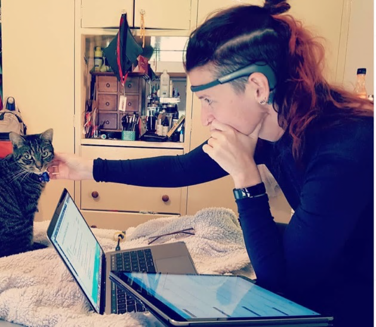
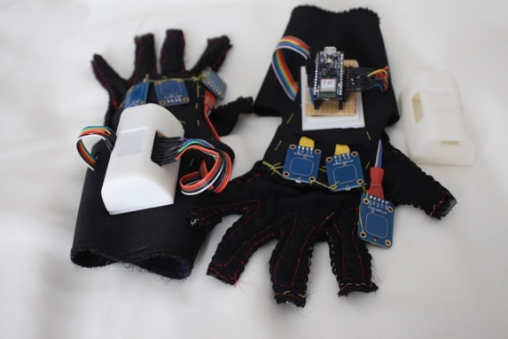
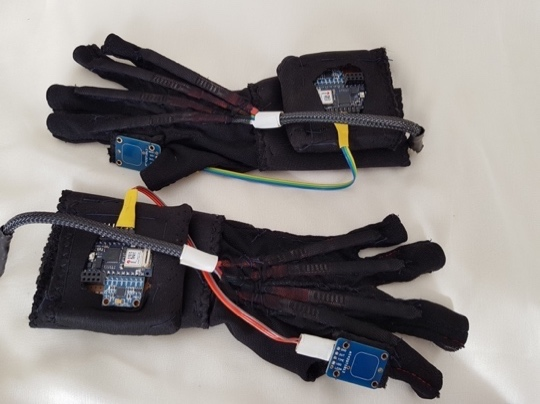

<!-- ***Keywords**: performative autoethnography; COVID-19 art; computer
music; singing; gestural music; social commentary; behavioural
contagion.* -->

# Introduction {#introduction .First-Level-Headings}

*Songs in Isolation* is a series of works composed during the 2020-2021
COVID-19 lockdowns in Melbourne, Australia. The pieces were a response
and documentation process for current events, public waves of
consciousness (anxiety, apathy, bread-making, et cetera), and the
importance of maintaining one's practice during isolation. The works use
various tools, such as human interface devices (HID) -- consumer EEG
(Electro-encephalogram) device *Muse 2* \[6\], self-built dataglove
gestural controllers (GLVD); and digital workstation tools such as *Max*
\[7\], *Ableton Live 11* \[8\], *Logic Pro X* \[9\]. Audio sources
included field recordings, sampling, and human voice using *Extended
Vocal Techniques* (EVT). EVT are singing techniques drawn from
contemporary, experimental, and non-Western styles. These techniques are
part of my practice and exploration as a singer-composer-performer and
are my primary choice for artistic expression. Each piece is a work of
performative autoethnography and was informed by embodiment studies and
body-centric practices.

COVID-19 created a dividing barrier between the world before and the
world after. Social contagion was a benign manifestation alongside the
viral contagion concerns. Behavioural contagion gave individuals a sense
of connection during a period of isolation in addition to fear-based and
emotional contagions as social phenomena (panic buying and hoarding of
toilet paper and other grocery goods, for example). These positive and
negative aspects spread through the internet \[10\]. Through our
physical separation, many attempted to remain connected via social
media. This facsimile of social connection was a potential super
spreader for behavioural trends, magnifying the normal engagement
through a heightened sense of fear and anxiety driven by the global
pandemic.

In this paper, I discuss social contagion during viral contagion through
COVID-19 artworks and the echoes of actions throughout society. I was
affected by behavioural contagion and discussed my works in the context
of each work's current events and as compared to songs that became viral
memes during the early stages of the pandemic. This work is limited to
my experiences and reactions to global phenomena. Perspective is often
granted through distance to the initial catalyst, particularly in
traumatic situations, as the COVID-19 pandemic has been for many people.
How do COVID-centric artworks bear witness to time, place, and space?
This research addresses these questions by looking at works through an
outward lens on social contagions \[11\], \[12\].

# Methodology {#methodology .First-Level-Headings}

This research is practice-based \[1\] autoethnography \[2\]. The pieces
and the writing are told through a personal lens, commenting on the
broader societal landscape and responding to COVID-19, political events,
and social issues. Understanding and interpreting the world through
making is central to my practice. Sullivan \[13\] describes knowing in
the arts as a braid-like structure, where the strands must be
continuously unwoven, sorted, and re-constructed through various
existing practices and enquiries. The pieces and social context move
together, buffeted by the movements of a virus and the success or
failure of each country with travel movements and location-specific
behaviours of the public.

My pieces serve as vehicles to explore social contagion, personal
experiences, and global phenomena. I experiment and innovate with
techniques, audio effects, and technologies, externalising personal
experiences. Furthermore, I employ body movements and brainwave data to
control sound generation, turning my body into an artistic interface.
Drawing heavily from personal experiences and reactions to events, I
acknowledge my perspectives and biases, reflecting on how these
experiences inform artistic choices and the embedded meaning in my work.

I use various wearable technologies and computer-based composition tools
to create the pieces. These devices are pivotal, as my approach is
significantly influenced by the tools used. Due to the importance of the
body and perceptions as integral components in the research, I have
drawn from embodiment \[14\], \[15\] due to its body-centric approach.
Embodiment, in straightforward terms, is the study of the interplay
between the body, brain, and objects in action. The composition
experiments were accompanied by a reflective journal containing
work-session reflections (intuitions, perceptions, techniques, analysis,
methods used, and health state). Each work was completed with a video
clip, uploaded to YouTube, and débuted at a SeenSound event (a monthly
sound and audio event run by Brigid Burke and Mark Pedersen in
Melbourne, Australia). Compositions were inspired by current events,
principally location-driven by Melbourne, Australia. However, the
heavily online nature of general life currently means a significant
cross-pollination from other countries.

## Location Context  {#location-context .Second-Level-Headings .unnumbered}

Living through Melbourne\'s COVID-19 lockdowns significantly influenced
my experience and that of my social circles during the early pandemic
stages. Initially, the Victorian government adopted a more relaxed
approach but later shifted towards stricter measures, which some viewed
as draconian. Personally, I hesitate to label them as such, as I
witnessed rule-breaking in my neighbourhood and through news articles
that painted a different picture. Instead, these restrictions seemed to
reflect a pessimism about society\'s commitment to collective
well-being, questioning Australia\'s deeply ingrained "mateship" values.

While Melbourne was relatively safe from high infection and death rates
compared to other global regions, the consequences of political and
societal failures were still challenging to endure. Families in
Australia were spared much COVID-related grief, but mental health
issues, particularly among women in Victoria, escalated \[16\], \[17\].
Additionally, traditional gender roles were reinforced during the
pandemic, with women taking on most of the added responsibilities in
housework and childcare \[18\].

# Behavioural Contagion {#behavioural-contagion .First-Level-Headings}

Behavioural contagion is a form of social contagion. These can be
malignant or benign; for example, behavioural and social contagion is
thought to be a factor in mass murders, suicide clusters, fads, and
viral internet memes[^1] \[19\]. Some examples of viral musical
audiovisual memes were the *Coronavirus Etude* \[20\] and *Get on the
Beers* \[21\]. Examples of behavioural contagion through social media
transmitted fads include the home salon (cutting and dying hair at
home), baking bread (especially sourdough bread), and panic buying.

It is thought that an explanation for social contagion may be the
"memetic stance because culture has an independent evolutionary dynamic
that is derived from the genetically evolved human capacity and
predisposition to replicate culture" \[19, p. 50\]. Marsden discusses
the success of social contagions being determined by stimulus and
response in evoking imitation. The internet provides easy access to both
stimulus and response-giving for individuals and groups.

The internet is considered a weak tie in social contagion. However, it
has further reach due to the length of the tie and network
possibilities. Centola discusses how "networks with long, narrow bridges
are useful for spreading information" but cautions that "too much
randomness can be inefficient for spreading the social reinforcement
necessary to act on that information" as risk and/or connectedness
decline \[10, p. 731\].

Since some works are responses to, and adoptions of, social and
behavioural contagion, I have sought to critique (at the time) current
events as a pseudo-pandemic diary. Some works are more lighthearted and
whimsical to cope with ever-pressing global concerns. The pieces become
thematically darker as time and circumstances wore on. This climaxes in
the ninth piece (or the last muse), where this work diverges into my
doctoral thesis and presentations of trauma as a composition tool to
externalise psychological states.

# The Nine Muses {#the-nine-muses .First-Level-Headings}

Here, I discuss the compositions relevant to this paper and how they
represent the global or local context at the time of composition. The
series is collectively called *Songs in Isolation*. The works are
discussed in the order composed and released. Links to YouTube videos
are provided for each piece[^2].

## I: Always Read the Instructions, April-May 2020 {#i-always-read-the-instructions-april-may-2020 .Second-Level-Headings .unnumbered}

This responds to the early 2020 trend of dying one's hair and chaotic
government communications about the pandemic. It uses speech, video, and
audio effects created in Logic Pro X \[9\]. The audio was recorded
during hair dyeing while delivering a perky, YouTube tutorial-style
address, paralleling the process of dying one's hair to creating art in
lockdown and upholding traditional productivity.

A theme of the pandemic has been globally mixed messaging concerning
health recommendations. In early 2020, the news was flooded with
opinions expressed as facts and insane medical advice was being spread
by prominent political figures and conspiracy theorists alike.
Uncertainty prevailed, and DIY haircare surged.

The layered and glitchy audio elements symbolise
information-disinformation cycles, medical recommendations filtered
through social media, and lockdown-induced hysteria. Text lines like "In
isolation, you really have to focus on solo projects" and "Always read
the instructions first" satirise the pressures imposed by workplaces,
governments, corporations, and universities for continued productivity
and consumption. These statements are juxtaposed with facial expressions
conveying grimaces, uncertain twitches, and sighs, further accentuated
through audio manipulation techniques within a Digital Audio Workstation
(DAW), resulting in glitching sounds.

Link to work: <https://youtu.be/NDrUtRkOdnw>

## II: Easing Restrictions, June 2020  {#ii-easing-restrictions-june-2020 .Second-Level-Headings .unnumbered}

This piece draws on the use of language, voice, and layering from Mark
Applebaum's *Three Unlikely Corporate Sponsorships* \[22\] series. It
responds to the untimely easing of COVID-19 restrictions in Australia in
June 2020, contrasting with New Zealand\'s cautious approach. I saw
mixed reactions on social media, with some enthusiastic about returning
to "normal" and others more cautious and sceptical.

I formed a score by stacking text layers in a word processor and
recording each layer using a low-quality headset microphone to emulate
early computer conferencing call quality. The text's position on the
page in the text score informed the pitch centre of each line's
delivery. The audio was processed with audio effects to separate the
layers sonically.

Text sources included social media themes like lockdown weight loss,
supermarket shortages, opinions on easing restrictions, and snippets
from news conferences on platforms such as the Australian Broadcasting
Company (ABC). Like Applebaum, employed speech rhythms and pitches to
shape the music deliberately in a playful manner.

Link to work: <https://youtu.be/ewcDSfh51uk>

## III: Umm... Omm?, July 2020 {#iii-umm-omm-july-2020 .Second-Level-Headings .unnumbered}

This piece extends my EVT and throat-singing practice from my master's
degree, investigating how physical and virtual locations affect voice
use. I composed it in response to social media's renewed emphasis on
meditation and creating peaceful environments during Melbourne\'s second
significant lockdown in July. I made layers of voice, using overtone
(filtering vocal formants by control of the tongue, oropharynx, and
nasopharynx) and undertone (period doubling the fundamental pitch with
the false vocal folds) singing. The initial layer draws inspiration from
the syllable "Om", commonly associated with meditation and yoga in
Indian religions. The piece features minimal harmonic movement but
shifting overtones and fundamentals, creating an unresolved space with
subtle tension that builds throughout and eventually fades without
musical resolution.

The goal was to craft a pseudo-meditation piece that offers a tranquil
yet somewhat edgy sonic environment, stepping beyond genre-specific
boundaries. That is, the lack of traditional harmony and an increased
dissonance in note selection. The intentionally short duration
prematurely disrupts established meditation music parameters.

Link to work: <https://youtu.be/8puSjA6O6_Q>

## IV: FuzzyLogic, September 2020 {#iv-fuzzylogic-september-2020 .Second-Level-Headings .unnumbered}

This piece responds to the heightening of my brain fog, amplified by my
doctoral project and the challenge of maintaining a positive educator
role amidst recurring anti-lockdown protests \[23\]. This étude was also
used for my doctoral thesis to test *Muse 2* (a consumer EEG device) as
an embodied sound controller and alternative to glove-based gesture
control. The title blends logic theory, its commonplace association with
washing machine ads, mundane existence, cognitive fuzziness (brain fog),
and the distortion control symbolism in translating my brain waves into
real numbers between 0 and 1.

Using voice and *Muse 2, (Figure 1)*, I yoked delta, theta, alpha, beta,
and gamma brain waves via OSC (Open Sound Control) from an iPad and a
secondary application, routing them into *Max* \[7\]. Each brain wave
type controlled a distinct sound source. One vocal layer encompassed
"ah" sounds with and without vocal fry (isolated vocal fold air pops)
and an undertone. The accompanying video was generated by recording the
device\'s output while listening to the final composition.

Link to work: <https://youtu.be/PkVjeE0VcNQ>



## V: Being Inside, October 2020 {#v-being-inside-october-2020 .Second-Level-Headings .unnumbered}

This piece was inspired by the relentless dripping of the bathroom sink
and shower taps, neglected by our landlords for years. Melbourne was on
the cusp of reopening, with each day aching for reconnection with
friends and family amidst the monotonous daily grind. To counter this
sameness, I resorted to haircuts for a change. Dripping taps are
universally irksome and have been employed as a torture method, notably
known as Chinese water torture \[24\].

I used *Max*, *Ableton Live*, *GLVD* (version three, with gestures:
fist, palm, peace sign, and pinky out, see *Figure 2*) and one hand
manually controlled volumes on a second MIDI controller. Due to CPU
intensity issues stemming from an unoptimised *GLVD* version three
*Max*-patch device interface, I employed a single glove to mitigate the
computing load. Unlike my other works, this piece does not feature
voice; I used the vibrating drone of hair clippers and reverb to enhance
overtones, mimicking the effect achieved with vocals.

Link to work: <https://youtu.be/Wutfkbiq930>



## VI: First, There Was Nothing, Then It Exploded, October 2021  {#vi-first-there-was-nothing-then-it-exploded-october-2021 .Second-Level-Headings .unnumbered}

This work uses voice and *GLVD*, version three; see *Figure 2*. It
combines serendipity, flow, and a sonic explosion. As Melbourne inched
towards easing most COVID-19 restrictions, transitioning into
"COVID-normal" rules \[25\]. The hayfever season coincided with this
prolonged lockdown, causing a sense of temporal and future
disorientation. This composition briefly provided solace.

A sudden data glitch unexpectedly intensified the self-made filter
effect in *Max* and reverb, resulting in a sonic explosion akin to a
missile detonation. I controlled this audio through the roll position of
my right wrist. The intermittent synth line emerged from my moments of
distraction (while keeping the other hand still) while grappling with
the substantial, distorted noise. The noise initially erupted
chaotically but gradually evolved into a structured sound that I could
control. This revelation brought the sound almost to silence, a choice I
briefly regretted before reigniting the noise. I became consumed by the
interaction but became self-conscious and halted the noise, believing I
had spent over 10 minutes engrossed in the activity. This unexpected
shift in time perception and the sound\'s engulfing quality resulted in
a temporal disconnection, aligning with '*flow'* and embodiment concepts
\[26\], \[27\]. The engagement was captivating due to its element of
surprise and initial unpredictability.

I opted to preserve the glitch unaltered to capture the depth of my
immersion in the activity, while the synth and speech segments leading
up to and following the glitch were edited to frame and document the
glitch. These segments were layered and panned in the final mix.

Link to work: <https://youtu.be/3ls4tD3G8W0>

## VII: Mood:2020, October 2020 -- January 2021 {#vii-mood2020-october-2020-january-2021 .Second-Level-Headings .unnumbered}

This piece, a collaborative effort with Little Songs of the Mutilated
under the coordination of Justin Ashworth, involved around 42
participants from a collective of over 120 individuals. Each participant
contributed a sample of five seconds or less, and the guidelines were
simple: create a piece with a duration ranging from three to fifteen
minutes, using at least 90% of the sounds from the shared sample
database. I integrated 17 of these samples, including my contribution.

I organised these samples into blocks by editing and combining multiple
samples. Then, employing GLVD version four (Figure 3), I generated
layers of sound by controlling the speed, pitch, and audio effects on
each sample block. Takes were performed, curated, and stacked to
construct the final composition[^3].

Its inspiration stemmed from one sample's name, "*MOOD20*". At the time,
I found humour in the track name, reflecting my crankiness, confinement,
and weariness of lockdown and winter. Much like a disgruntled parent
would put it, I was in a "mood". This emotion seemed to resonate with
the prevailing sentiment in Melbourne when I began crafting the piece.

Link to work: <https://youtu.be/u3hisGPoK4E>

 

## VIII: Flame, February 2021 {#viii-flame-february-2021 .Second-Level-Headings .unnumbered}

This piece uses breath, field recordings, and a lighter. It was written
in response to being told of the terminal illness of a friend that was
left to fester during COVID-19, renewed urges to ease restrictions
unwisely, anti-vaccination protests, vaccination rollout bungles, wimpy
climate change action by the Australian government, poor handling of
sexual assault in Australian workplaces, and confused aid requirements
amid smaller scale lockdowns in Victoria, Australia. This composition
marks a shift away from the intense emotional and behavioural
connections experienced during the initial COVID-19 lockdown periods,
representing mounting frustrations arising from inaction, complacency,
and the repetitiveness of these experiences.

Breath and lighter flicking samples accompany each other and interact
with field recordings and natural bush sounds captured at Organ Pipes
National Park, VIC, in January 2021. The breath sounds reinforce the
bird songs and fire crackles, acting as the gas flows through the
lighter with soft whistles, inhales, exhales, and other mouth noises.
Rhythmic inhales and exhales, occasionally intertwined with subtle
inward phonation, create a subdued climax in the composition,
symbolising Australia's governmental conservation apathy.

Link to work: <https://youtu.be/jTRzBAY99VA>

## IX: Your Subconscious is Knocking, Pt. 1, September 2021  {#ix-your-subconscious-is-knocking-pt.-1-september-2021 .Second-Level-Headings .unnumbered}

This piece encapsulates the lingering impact of COVID lockdowns, the
traumatic experiences facilitated by the altered communication dynamics
of the COVID era, and the escalating prevalence of gender-based online
abuse \[28\]--\[30\]. During traumatic events described in the concealed
text (layer 1), my brain underwent transient amnesia (dissociation),
erasing the trauma details and leaving only the lingering symptoms.
Dissociation arises when the brain becomes overwhelmed and temporarily
disconnects from a situation, leading to brief or extended periods of
detachment.

This composition comprises two layers and was crafted using *Max* and
voice. The first layer features text-driven noise that recounts an
abusive situation I endured from 2020 to 2021, primarily unfolding
through an online platform. The noise gate allows sound to pass through
when the text is spoken. The second layer becomes audible during
instances of "Shh" and breath or mouth sounds (this second noise gate
operates similarly to the first). The second layer interacts with the
first, causing a reduction in the first layer\'s sound.

The recurring "Shh" symbolises moments of disconnection within my brain,
while the initial, quieter tonal noise represents my experience --- my
subconscious and body attempting to communicate. When the shushing takes
precedence over the first layer, it imitates the momentary dissociation
of a besieged mind. The various "Shh" iterations reflect the brain's
capacity for effective self-censorship with varying degrees of
intensity.

Link to work: <https://youtu.be/Q4rF_uZkXNc>

# Discussion {#discussion .First-Level-Headings}

During the first two years of the COVID-19 pandemic, especially in
Melbourne, we craved human connections despite physical distancing. We
sought virtual unity through trends, collective emotions, social media,
and digital conferences. We spent much time plodding through life and on
video-conferencing calls. I intended to document these shared
experiences sonically -- down to the home hairdressing trends, pets
wandering in front of the camera during meetings, and toilet paper
shortages creating a pandemic diary. The resulting works reveal a theme
of online contagion and offer social commentary on issues amplified
through viral transmission, which I explore through proximity,
contagion, play, and humour.

## Proximity and Contagion {#proximity-and-contagion .Second-Level-Headings .unnumbered}

*Songs in Isolation* acts as a time capsule and commentary on early
pandemic experiences, reflecting our collective sense of anxiety and
responses. These were our collective angst. Many individuals maintain
social connections through social media and platforms such as Zoom. Each
work demonstrates a facet of the COVID-19 experience. Surprisingly,
earlier works demonstrate a greater unification with the cultural
zeitgeist than later works. This could be due to the easing of
restrictions providing a social outlet. By piece eight, more pressing
matters became evident from COVID-19 for my social circle and me, so our
experiences diverged.

These initial emotional shifts and engagements in trending activities
illustrate examples of convergence or emotional contagion, likely
influenced by empathy and the mirror neuron system[^4] \[31\] \[32\].
Research shows that emotional contagion is driven by empathy, a quality
generally found to be higher among artists \[33\]. When I was filled
with grief for the death of my previous life, other people were in a
similar space, and then when I moved through it, they would have done
too. Even in physical isolation, emotions appeared to travel through
digital communications.

Different reactions to upheaval fuelled trends, driven by factors such
as boredom, minor acts of rebellion, the so-called Lipstick Effect[^5]
\[34\], a desire for community through shared activities, and heightened
anxiety. For instance, panic buying, a socially undesirable herd
behaviour, emerged due to perceived threats and product scarcity,
influenced by an individual's social network and the need for control in
a situation where one felt helpless \[35\], \[36\]. Another noteworthy
thread was the compulsion to change one's appearance \[32\], \[34\],
particularly evident in the surge of DIY haircare facilitated by the
sudden unavailability of salon appointments. Beyond my normal
predilection for DIY, I could control my public-facing response through
creative works documenting my experience. These compositions aimed to
inject humour and light-heartedness into the pandemic narrative, using
emotional contagion to relieve the general stress of living through a
pandemic.

Each work in *Songs in Isolation* deals with a different emotional wave.
Earlier works exhibit a tongue-in-cheek approach to social and mental
health phenomena. The sonic textures remain aesthetically consistent
between pieces. I generally used low-budget technology and rapid
composition turnarounds to authentically capture evolving events. A
downside is the lack of predictable structure in intervals between
compositions. More reliable trends might have been captured in one piece
every two to four weeks. Regularly generating and sharing works online
increases the likelihood of algorithmic recognition. However, this added
pressure might result in stilted work, burnout, and a lack of relevance
as trends fluctuate.

Notably, some prominent pandemic trends, like bread baking and toilet
paper shortages, are not featured in these compositions. Conversely,
albeit subtly incorporated, panic buying reflects toilet paper\'s
unpredictable availability in my local supermarket, for example, in
*Easing Restrictions*. Toilet paper remains an item that is
inconsistently available in my local supermarket. However, these were
trends that I and my household avoided during the main lockdowns for
various reasons. The home salon trend paralleled my usual, non-COVID
life. This allowed easy integration into the creative process as the
regularity of haircuts and hair dye meant that I could engage during my
normal routine. This contributed positively to the internet\'s weak tie
effect in social contagion, lowering the entry barrier.

Some of the inspiration for these compositions stems from darker
experiences, such as the connection between *Your Subconscious is
Knocking* and the theme of abuse, all linked by the profound sense of
isolation and trauma. These thematically darker works are handled more
seriously, collectively revealing a downward trend in mental health and
emotional resources. They serve as snapshots of moments when I
experienced increasing social isolation, in stark contrast to others
becoming less restricted, thus documenting the detrimental effects of
prolonged government-mandated isolation.

## Play and Humour {#play-and-humour .Second-Level-Headings .unnumbered}

Humour, particularly dark humour, is often used as a crutch when we deal
with difficult circumstances[^6] \[37\]. In not using overt sonic
aggression cues (except for distortion in *Fuzzy Logic*), the emotional
tone of the pieces is kept light. Even *Always Read the Instructions*,
*Your Subconscious is Knocking, pt.1*, and *First There Was Nothing,
Then It Exploded* with their glitchy, shaped noise, emphasise tonality
and timbre. They achieve this by juxtaposing absurd elements like an
overly cheerful speaking voice, librarian shushing, and unconventional
synthesizer lines.

Other absurd elements the mundanity of everyday lives, featuring
elements like a cat sample in *Mood:2020*, recurring home hairdressing
themes, and text content in *Easing Restrictions*. They also document
the waves of larger social consciousness, albeit through the lens of an
individual's biases[^7]. By framing my work through nonsensical and
surreal depictions of news, emotions, and trends, I aim to offer a
humorous perspective. This approach cloaks potentially distressing
emotions, presenting them as subjects for light-hearted amusement rather
than expressing them with excessive distortion or anger.

The confinement of endless Zoom calls and restricted outdoor activities
triggered a sense of entrapment. To counter this, I embraced novel
instruments for musical expression, such as the *GLVD*, and repurposed
devices like *Muse 2* in a playful manner. These novel instruments
facilitated embodied interactions with sound, a subject I continue
exploring in my doctoral thesis. Embodiment and one's connection to the
body can be disrupted through traumatic situations by the individual's
conscious or unconscious distancing from emotions and anxiety as somatic
consequences. This research is beyond the scope of a single article.

As a summary of ongoing research, novel physical interaction with sound
manipulation and sound creation changes my sonic output to explorations
of timbre and physically generated manipulations. This functionally
means often using continuous controls rather than stepped controls. This
shift and incorporation of the whole body in the creative process
disrupted my conventional practice as a singer and
multi-instrumentalist. It gave a positive reason to engage with computer
music after long workdays and provided release through the creative
process. Moreover, it prompted adjustments in my performance goals,
emphasising grace and the delicate balance of being a singer, dancer,
and accompanist, reigniting my involvement in dance as an art form with
its distinct bodily demands. This experience informs my future research,
particularly exploring the development of proprioceptive skills and
aesthetics in gestural performance, building upon Mainsbridge\'s work
\[38\].

## Technologies' Impacts {#technologies-impacts .Second-Level-Headings .unnumbered}

Quick turnarounds for most pieces led me to use whatever was readily
available in addition to my doctoral research on wearable and embodied
interfaces. This sometimes resulted in a low-budget approach, reflecting
the shift to home devices compared to professional setups. Musicians,
including professionals, students, and amateurs, often faced a reduction
in the quality of their tools during the pandemic. As mentioned in
*Easing Restrictions*, these lower-quality devices were used
intentionally to colour and code the recordings towards this purpose.

I used Zoom H1 and H5 devices in field recordings. I preferred the H1
for its portability, minimal mental effort, and convenience (powered by
a single AA battery). This cost-effective choice streamlined
decision-making, mirroring the reduction in choices imposed by
Melbourne's strict curfews. I prioritised devices with low cognitive
demands, reflecting and paralleling the pandemic's emotional toll,
financial strain, and Zoom fatigue, characterised by eye strain,
constant self-monitoring, reduced mobility, frozen positions, and
heightened cognitive load compensating for diminished non-verbal
communication \[39\], \[40\].

# Conclusions {#conclusions .First-Level-Headings}

COVID-19 continues to shape our lives, as are online platforms and
contagious behaviours. *Songs in Isolation* addresses the enduring
impact of COVID-19 on our lives, particularly interrogating these
contagions. These compositions serve as a sonic diary, encapsulating
collective trauma and my personal experience during the first 18 months
of the pandemic. Comprising nine distinct works, each captures specific
moments shaped by global and local socio-political contexts, primarily
Melbourne, Australia. The topics encompass frustrations with public
messaging, government competence, panic buying, corporate lobbying, and
the spread of disinformation. Though I used quick turnarounds to capture
moods, irregular intervals between pieces limit their ability to
comprehensively capture specific trends.

The compositions provide a sonic commentary on our evolving social
landscape, exploring proximity, contagion, and humour. They mirror
emotional shifts and engagement in trending activities during the
pandemic\'s early stages, emphasising emotional contagion through
empathy and digital communication. The pieces explore various trends and
behaviours influenced by social media, such as panic buying and DIY
haircare, shedding light on the role of online contagion. The series
balances light-hearted tones and darker themes related to isolation and
trauma, portraying the emotional toll of prolonged social separation,
and changing circumstances.

Playfulness and humour feature prominently, offering solace amidst
challenging emotions and experiences. Absurd elements and surreal
depictions engage the audience and provide relief from pandemic-induced
stress.

Integrating novel interfaces like the *GLVD* and *Muse 2* adds a playful
dimension, facilitating embodied sound interactions and enhancing the
compositions\' distinctiveness.

Where possible, pieces were crafted with low-budget technology,
leveraging available resources and other research strands. The
cost-effective approach reflects the pandemic's shift from professional
setups to home environments. Intentional use of lower-quality devices
mirrors pandemic themes in compositions. Field recording devices
highlighted the value of simplicity and reduced cognitive load,
underscoring artists\' adaptability in adversity and offering lessons
for future creative endeavours during crises.

# References {#references .First-Level-Headings}

```{=latex}
\begin{hangparas}{1.5em}{1}
```

\[1\] L. Candy, "Practice Based Research: A Guide," University of
Technology, Sydney, AU, CCS 2006-V1.0 November, 2006.

\[2\] T. Spry, *Body, Paper, Stage: Writing and Performing
Autoethnography*. Walnut Creek, UNITED STATES: Routledge, 2011.
Accessed: Apr. 07, 2020. \[Online\]. Available:
<http://ebookcentral.proquest.com/lib/unimelb/detail.action?docID=843865>

\[3\] Genki Instruments, *Wave*. 2019. Accessed: Mar. 14, 2022.
\[Dataring\]. Available: <http://genkiinstruments.com/products/wave>

\[4\] MiMu Gloves LTD, *MiMu*. 2010. Accessed: Oct. 18, 2021.
\[Datagloves\]. Available: <https://mimugloves.com/>

\[5\] S. Rose, *GLVD (Gently Leveraging Variable Decisions)*. 2020.
Accessed: Apr. 26, 2023. \[Datagloves\]. Available:
<https://www.youtube.com/watch?v=Rphplar3RUo>

\[6\] InteraXon Inc., *Muse 2: Brain Sensing Headband - Technology
Enhanced Meditation*. 2020. Accessed: Jun. 27, 2022. \[Consumer EEG
Headband\]. Available: <https://choosemuse.com/muse-2/>

\[7\] Cycling '74, "Max MSP." Cycling '74, USA, 2018.

\[8\] Ableton, "Ableton Live 11." Ableton, Germany, 2021.

\[9\] Apple Inc., "Logic Pro X." Apple Inc., USA, 2022.

\[10\] D. Centola, "Complex Contagions and the Weakness of Long Ties,"
*Am. J. Sociol.*, vol. 113, no. 3, pp. 702--734, Nov. 2007, doi:
10.1086/521848.

\[11\] R. E. Riggio and C. R. Riggio, "Social contagion," in
*Encyclopedia of Mental Health (Third Edition)*, H. S. Friedman and C.
H. Markey, Eds., Oxford: Academic Press, 2023, pp. 270--273. doi:
10.1016/B978-0-323-91497-0.00192-2.

\[12\] T. Cochrane, B. Fantini, and K. R. Scherer, Eds., "Music to
Listener Emotional Contagion," in *The emotional power of music:
Multidisciplinary perspectives on musical arousal, expression, and
social control*, in Series in affective science. Oxford: Oxford
University Press, 2013.

\[13\] G. L. Sullivan, "Making space: The purpose and place of
practice-led research," *Pract.-Led Res. Res.-Led Pract. Creat. Arts*,
pp. 41--65, Jun. 2009.

\[14\] R. Shusterman, "Somaesthetics: A Disciplinary Proposal," *J.
Aesthet. Art Crit.*, vol. 57, no. 3, pp. 299--313, 1999, doi:
10.2307/432196.

\[15\] G. Sullivan, *Art Practice as Research: Inquiry in Visual Arts*,
2nd ed. USA: SAGE Publications, Inc., 2010. Accessed: Aug. 26, 2019.
\[Online\]. Available:
<https://au.sagepub.com/en-gb/oce/art-practice-as-research/book233902>

\[16\] P. Butterworth, S. Schurer, T.-A. Trinh, E. Vera-Toscano, and M.
Wooden, "Effect of lockdown on mental health in Australia: evidence from
a natural experiment analysing a longitudinal probability sample
survey," *Lancet Public Health*, vol. 7, no. 5, pp. e427--e436, May
2022, doi: 10.1016/S2468-2667(22)00082-2.

\[17\] P. Hosseinzadeh, M. Zareipour, E. Baljani, and M. R. Moradali,
"Social Consequences of the COVID-19 Pandemic. A Systematic Review,"
*Investig. Educ. En Enfermeria*, vol. 40, no. 1, Apr. 2022, doi:
10.17533/udea.iee.v40n1e10.

\[18\] A. Sevilla and S. Smith, "Baby steps: the gender division of
childcare during the COVID-19 pandemic," *Oxf. Rev. Econ. Policy*, vol.
36, no. Supplement_1, pp. S169--S186, Sep. 2020, doi:
10.1093/oxrep/graa027.

\[19\] P. Marsden, "Memetics and Social Contagion: Two Sides of the Same
Coin?," *J. Memet.*, vol. 2, pp. 171--185, Jan. 1998.

\[20\] J. DePaoli, *Coronavirus Etude (For Piano and Disinfecting
Wipe)*. 2020. \[Music\]. Available:
<https://www.youtube.com/watch?v=XP5dPn_eP7Q>

\[21\] Mashd N Kutcher, *Get on the Beers (feat. Dan Andrews)*. 2020.
Accessed: Oct. 03, 2022. \[Meme, Audiovisual Music Video\]. Available:
<https://www.youtube.com/watch?v=7hOK5JF5XGA>

\[22\] M. Applebaum, *Three Unlikely Corporate Sponsorships*. 2016.

\[23\] M. McGowan, "Melbourne anti-lockdown protests: at least 15
arrested in violent clashes with police," *The Guardian*, Sep. 05, 2020.
Accessed: Jun. 26, 2023. \[Online\]. Available:
<https://www.theguardian.com/australia-news/2020/sep/05/melbourne-anti-lockdown-protests-dozens-arrested-in-violent-clashes-with-police>

\[24\] M. de Young, *Encyclopedia of Asylum Therapeutics, 1750-1950s*.
McFarland, 2015.

\[25\] J. Taylor, "Melbourne to reopen after more than four months of
Covid lockdown," *The Guardian*, Oct. 26, 2020. Accessed: Jun. 26, 2023.
\[Online\]. Available:
<https://www.theguardian.com/australia-news/2020/oct/26/melbourne-to-reopen-after-more-than-four-months-of-covid-lockdown>

\[26\] D. A. Schön, *The Reflective Practitioner: How Professionals
Think in Action*. Routledge, 1983. doi: 10.4324/9781315237473.

\[27\] M. Csikszentmihalyi, *Flow: The Psychology of Optimal
Experience*. HarperCollins e-books, 2009.

\[28\] D. M. H. Kee, M. A. L. Al‐Anesi, and S. A. L. Al‐Anesi,
"Cyberbullying on social media under the influence of COVID‐19," *Glob.
Bus. Organ. Excell.*, vol. 41, no. 6, pp. 11--22, 2022, doi:
10.1002/joe.22175.

\[29\] C. Wahlquist, "'Distressing and confronting': online sexual
harassment rises for Australian university students during Covid," *The
Guardian*, Mar. 23, 2022. Accessed: Jun. 27, 2023. \[Online\].
Available:
<https://www.theguardian.com/australia-news/2022/mar/23/distressing-and-confronting-online-sexual-harassment-rises-for-australian-university-students-during-covid>

\[30\] M. Berger, "Gender-based online abuse surged during the pandemic.
Laws haven't kept up, activists say.," *Washington Post*, Nov. 25, 2021.
Accessed: Jun. 27, 2023. \[Online\]. Available:
<https://www.washingtonpost.com/world/2021/11/24/online-abuse-surged-during-pandemic-laws-havent-kept-up-activists-say/>

\[31\] T. Eerola, J. K. Vuoskoski, and H. Kautiainen, "Being Moved by
Unfamiliar Sad Music Is Associated with High Empathy," *Front.
Psychol.*, vol. 7, 2016, Accessed: Jun. 27, 2022. \[Online\]. Available:
<https://www.frontiersin.org/article/10.3389/fpsyg.2016.01176>

\[32\] J. A. C. J. Bastiaansen, M. Thioux, and C. Keysers, "Evidence for
mirror systems in emotions," *Philos. Trans. R. Soc. B Biol. Sci.*, vol.
364, no. 1528, pp. 2391--2404, Aug. 2009, doi: 10.1098/rstb.2009.0058.

\[33\] E. Hatfield, R. L. Rapson, and Y.-C. L. Le, "Emotional contagion
and empathy," in *The social neuroscience of empathy*, in Social
neuroscience. Cambridge, MA, US: Boston Review, 2009, pp. 19--30. doi:
10.7551/mitpress/9780262012973.003.0003.

\[34\] P. N. Danziger, "With Recession Threatening, The Lipstick Effect
Kicks In And Lipstick Sales Rise," *Forbes*, Online, Jun. 01, 2022.
Accessed: Jun. 27, 2022. \[Online\]. Available:
<https://www.forbes.com/sites/pamdanziger/2022/06/01/with-inflation-rising-the-lipstick-effect-kicks-in-and-lipstick-sales-rise/>

\[35\] U. Dholakia, "How Anxiety Affects Our Buying Behaviors \|
Psychology Today Australia," *Psychology Today*, vol. Online, Mar. 30,
2020. Accessed: Dec. 13, 2021. \[Online\]. Available:
<https://www.psychologytoday.com/au/blog/the-science-behind-behavior/202003/how-anxiety-affects-our-buying-behaviors>

\[36\] K. F. Yuen, X. Wang, F. Ma, and K. X. Li, "The Psychological
Causes of Panic Buying Following a Health Crisis," *Int. J. Environ.
Res. Public. Health*, vol. 17, no. 10, p. 3513, May 2020, doi:
10.3390/ijerph17103513.

\[37\] L. Martens, "Dark Humor and Childhood Trauma," *"Are you okay?,"*
Jun. 26, 2019.
<https://medium.com/are-you-okay/dark-humor-and-childhood-trauma-988dc3c64396>
(accessed Mar. 07, 2022).

\[38\] M. Mainsbridge, *Body as Instrument: Performing with Gestural
Systems in Live Electronic Music*. Bloomsbury Academic, 2022. doi:
10.5040/9781501368578.

\[39\] L. (Elizabeth) Sander and O. Baumann, "5 reasons why Zoom
meetings are so exhausting," *The Conversation*, Australia, May 05,
2020. Accessed: Sep. 12, 2023. \[Online\]. Available:
<http://theconversation.com/5-reasons-why-zoom-meetings-are-so-exhausting-137404>

\[40\] A. Vergallito *et al.*, "Explicit and Implicit Responses of
Seeing Own vs. Others' Emotions: An Electromyographic Study on the
Neurophysiological and Cognitive Basis of the Self-Mirroring Technique,"
*Front. Psychol.*, vol. 11, 2020, Accessed: Sep. 12, 2023. \[Online\].
Available: <https://www.frontiersin.org/articles/10.3389/fpsyg.2020.00433>

```{=latex}
\end{hangparas}
```

[^1]: Pictures shared peer-to-peer on social media, generally with a
    text caption over the top, sometimes involving sound or moving
    images and normally amusing.

[^2]: DOIs can be provided.

[^3]: A timelapse video of one layer's recording can be viewed at
    <https://youtu.be/OCBy0Q2RT7k>, where I manage sample starts and
    stops and control audio effects like speed, distortion, and
    filtering.

[^4]: The mirror neuron system is a specialised group of neurons in the
    brain that mirror the behaviours and actions of other people. This
    system is implicated in language, empathy, and social cognition,
    among others.

[^5]: Where (mostly) women make small discretionary purchases to provide
    an emotional uplift in times of economic downturn.

[^6]: In this case, individual and collective trauma.

[^7]: A capsule of my biases: feminist, left-leaning, pro-vaccination,
    and pro-science, but from a very small-town farming upbringing.